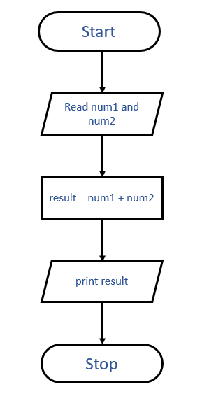

# Algorithm & Flowchart of Sum of two numbers

```
Step 1 : Start
Step 2 : Read num1 and num2
Step 3 : Add num1 and num2 and assign in result
            result = num1 + num2
Step 4 : print result
Step 5 : Stop
```
