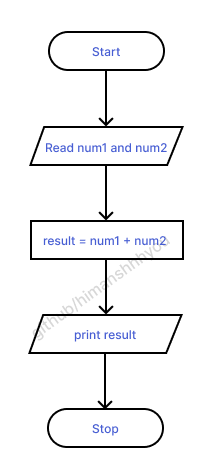
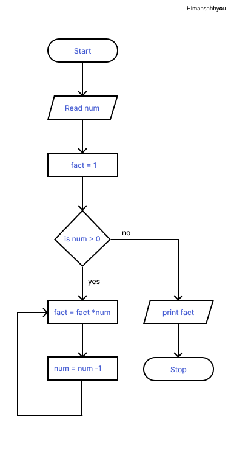
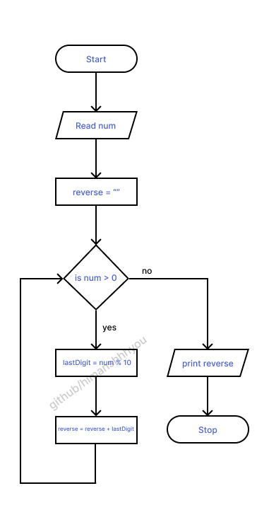
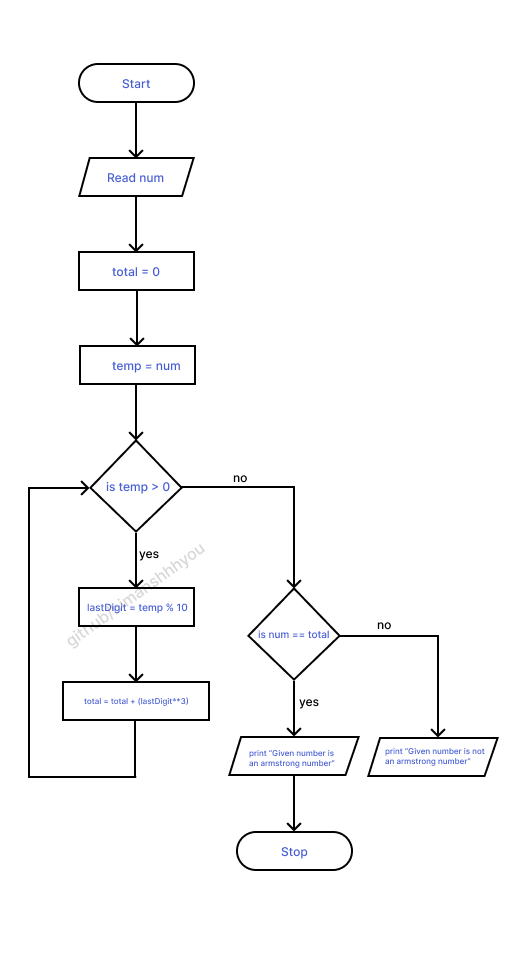

# Algorithm & Flowchart

An algorithm is a step-by-step procedure or set of rules designed to perform a specific task or solve a particular problem. It serves as a blueprint for solving problems and is often expressed in pseudocode or a programming language. Algorithms are essential in computer science, guiding the execution of tasks efficiently.

A flowchart is a visual representation of an algorithm, using different shapes to denote various actions, decisions, or inputs. It provides a graphical overview of the algorithm's logic and helps in understanding the flow of control.

## Table of content
1. [Sum of two numbers](#sum-of-two-numbers)
2. [Factorial](#Factorial)
3. [Reverse a number](#reverse-a-number)
4. [Armstrong number](#armstrong-number-for-3-digit-armstrong-number)

   <hr>

###  Sum of two numbers
```
Step 1 : Start
Step 2 : Read num1 and num2
Step 3 : Add num1 and num2 and assign in result
            result = num1 + num2
Step 4 : print result
Step 5 : Stop
```


### Factorial
The factorial of a non-negative integer, often denoted by the symbol "!", is the product of all positive integers less than or equal to that integer. For example, the factorial of 5 (written as 5!) is calculated as:
> 5!=5×4×3×2×1=120

[Click here to see python code](../programs/factorial.py)

```
Step 1 : Start
Step 2 : Read num
Step 3 : Declare temp = 1 
Step 4 : is num > 0, if yes then go to next step otherwise go to step 7
Step 5 : fact = fact * num
Step 6 : num = num -1 and go to step 3
Step 7 : print fact
Step 8 : Stop
```




### Reverse a number
[Click here to see python code](../programs/reverse.py)

```
Step 1 : Start
Step 2 : Read num
Step 3 : Declare reverse = ""
Step 4 : is num > 0, if yes then go to next step otherwise go to step 8
Step 5 : lastDigit = num % 10
Step 6 : reverse = reverse + lastDigit
Step 7 : num = num // 10 and go to step 4
Step 8 : print reverse
Step 9 : Stop
```
> Remember that, In step 6 you have to use typecasting to convert remainder into string before concatenation with reverse




### Armstrong number (for 3 digit armstrong number)
An Armstrong number is a number that is equal to the sum of its digits raised to the power of the number of digits. For example, 153 is an Armstrong number because 1<sup>3</sup> + 5<sup>3</sup> + 3<sup>3</sup> = 153

To check if a number is an Armstrong number, you can follow these steps:

- Count the number of digits in the number. Let this be n.
- For each digit in the number, raise it to the power of n and add it to a sum - variable.
- Compare the sum variable with the original number. If they are equal, the number is an Armstrong number. Otherwise, it is not.<br>
[Click here to see python code](../programs/armstrong.py)

```
Step 1 : Start
Step 2 : Read num
Step 3 : Declare total = 0 and temp = num
Step 4 : is temp > 0, if yes then go to next step otherwise go to step 8
Step 5 : lastDigit = num % 10
Step 6 : total = total + (lastDigit**3)
Step 7 : num = num // 10 and go to step 4
Step 8 : is num == total, if yes then go to step 9 otherwise go to step 10
Step 9 : print "Given number is an armstrong number" and go to step 11
Step 10 : print "Given number is not an armstrong number" and go to step 11
Step 11 : Stop
```
> Remember that this algorithm and flowchart is only for 3 digit armstrong number



