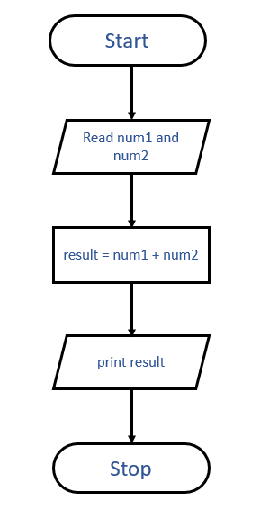

# Algorithm & Flowchart

## Table of content
 [1. Sum of two numbers](#sum-of-two-numbers)
2. [Factorial's algorithm & flowchart](Factorial's-algorithm-&-flowchart)

   <hr>

###  Sum of two numbers
```
Step 1 : Start
Step 2 : Read num1 and num2
Step 3 : Add num1 and num2 and assign in result
            result = num1 + num2
Step 4 : print result
Step 5 : Stop
```


### Factorial's algorithm & flowchart
```
Step 1 : Start
Step 2 : Read num and declare fact = 1
Step 3 : is num > 0, if yes then go to next step otherwise go to step 6
Step 4 : fact = fact * num
Step 5 : num = num -1 and go to step 3
Step 6 : print fact
Step 7 : Stop
```


