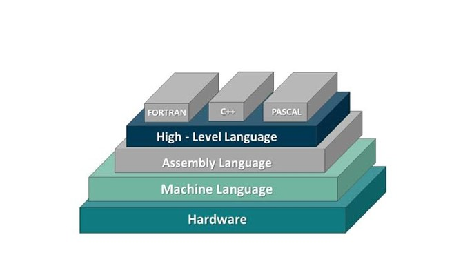
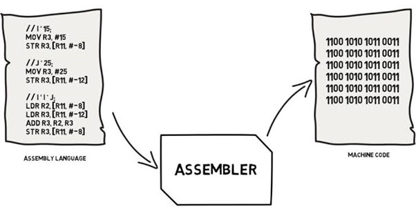
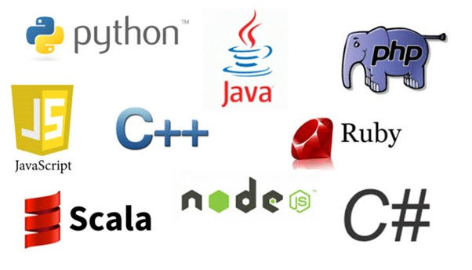
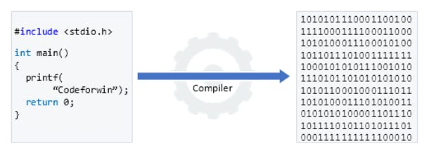
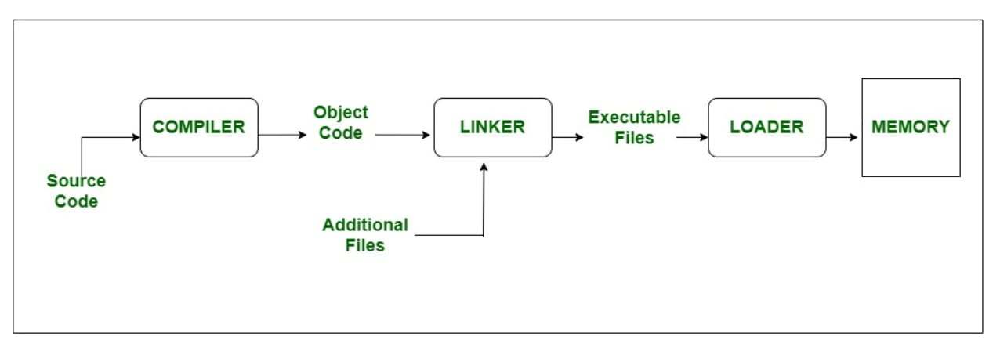

# Programming language

A programming language is a language that is used by programmers to communicate with computers.

A programming language serves as a bridge between humans and computers, offering a structured and readable set of commands that when written,enables computers to execute specific tasks

## Classification of computer language

1.  Machine language
2.  Assembly language
3.  High level language



### Machine language

- Collection of binary digits (0,1)
- Directly understood by CPU
- Fastest
- No requirement of any translator to translate the code
- Unreadable by humans
- Hard to maintain and debug
- 00101010110011110010100


### Assembly language



- Uses mnemonic codes like ADD, SUB, CMP
- Faster than high level language
- <p style="color:red">Major disadvantage is that assembly language is machine dependent</p>
- A program written for on computer might not run in other computers with different hardware configuration

### High level language



- Very near to human understanding
- Uses compilers and interpreters to translate the code into machine code
- Slower than Machine code
- Can not communicate directly with hardware


## Source language and object language



# Linker and Loader



# Testing

- Check if the application is working same as it was supposed to do
- Finding errors and bugs


# Debugging

- Activity perform by developers to fix the bugs and errors
- Erros in the program is fetched and fixed


# Errors

## Syntax error

- Occur when the rules or syntax of the programming language is not followed
- Involve incorrect punctuation, incorrect word sequence, undefined terms


```python
age = 19
if (age>=18)
    print("You can vote")
else:
    print("You cannot vote")
```


      Cell In[9], line 2
        if (age>=18)
                    ^
    SyntaxError: expected ':'
    


## Runtime Error

- Misinterpretation of particular instructions
- Dividing the number by 0


**Example 1**


```python
print(3/0)
```


    ---------------------------------------------------------------------------

    ZeroDivisionError                         Traceback (most recent call last)

    Cell In[18], line 1
    ----> 1 print(3/0)
    

    ZeroDivisionError: division by zero


**Example 2**


```python
myList = [1,2,3]
print(myList[3])
```


    ---------------------------------------------------------------------------

    IndexError                                Traceback (most recent call last)

    Cell In[6], line 2
          1 myList = [1,2,3]
    ----> 2 print(myList[3])
    

    IndexError: list index out of range


## Logical Error

- Computer does not print the correct output
- Computer does not tell what is wrong

**Example 1**


```python
a = 5
b = 3
print("Sum of a and b is: "+str(a-b))
```

    Sum of a and b is: 2
    

**Example 2**


```python
r = 3
area = 3.14*r*2
print("Area of circle is: "+str(area))
```

    Area of circle is: 18.84
    
